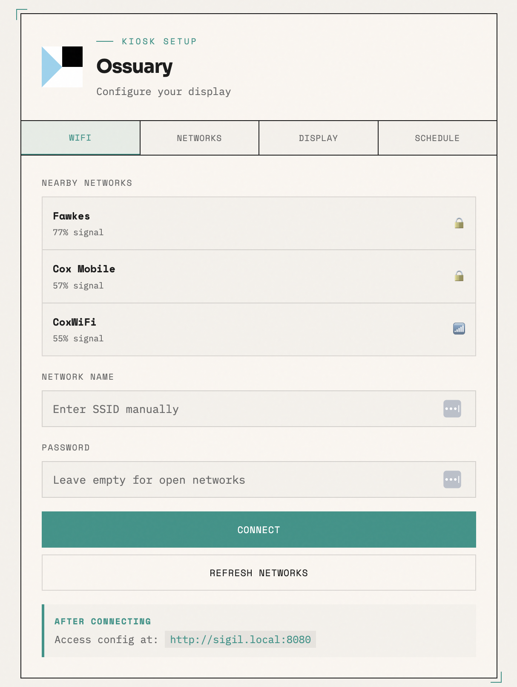
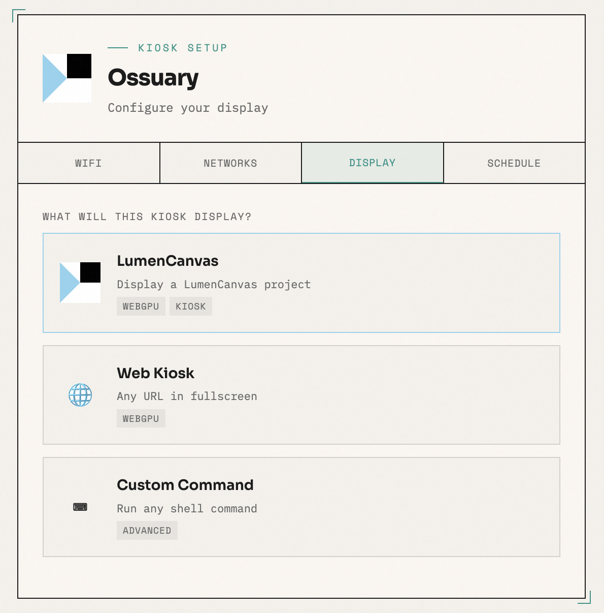
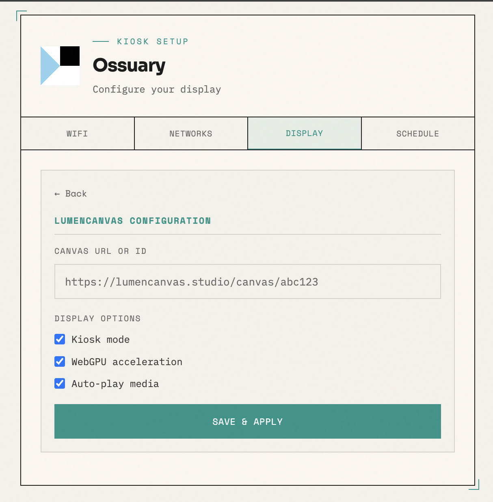
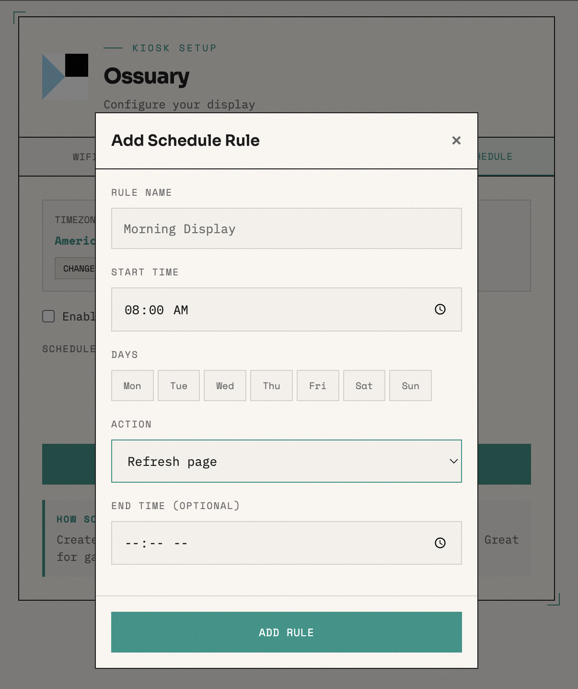

# Ossuary Pi

<p align="center">
  <a href="https://lumencanvas.studio">
    
  </a>
</p>

<p align="center">
  <strong>The ultimate kiosk system for Raspberry Pi</strong><br>
  Built for <a href="https://lumencanvas.studio">LumenCanvas</a> with WiFi failover, WebGPU support, and seamless configuration.
</p>

<p align="center">
  <a href="#features">Features</a> •
  <a href="#quick-start">Quick Start</a> •
  <a href="#full-setup-guide">Full Setup</a> •
  <a href="#configuration">Configuration</a> •
  <a href="#troubleshooting">Troubleshooting</a>
</p>

---

## Features

- **Automatic WiFi failover** — Falls back to AP mode when no known network is available
- **First-run welcome page** — Shows setup instructions on the Pi's display until configured
- **LumenCanvas first-class support** — WebGPU enabled, kiosk optimized, refresh behaviors built-in
- **Captive portal configuration** — Configure WiFi and startup commands from any device
- **Always-accessible control panel** — Web UI available at `hostname.local:8080` when connected
- **Connection-aware behaviors** — Auto-refresh on reconnection, scheduled refreshes, connection monitoring
- **Process management** — Keeps your kiosk app running with automatic restart on crash
- **Chromium kiosk mode** — Pre-configured flags for password-store, crash recovery, and error suppression

## Requirements

- Raspberry Pi 4 or 5 (64-bit recommended)
- Raspberry Pi OS Bookworm (2024) or Trixie (2025+)
- MicroSD card (16GB+ recommended)
- WiFi connectivity
- Display connected for kiosk mode

---

## Quick Start

If you already have a Pi with Raspberry Pi OS and SSH access:

```bash
git clone https://github.com/lumencanvas/ossuary-pi.git
cd ossuary-pi
sudo ./install.sh
```

The installer will configure everything and reboot. After reboot, access the control panel at `http://your-pi-hostname.local:8080`.

---

## Full Setup Guide

### Step 1: Prepare the SD Card

1. **Download Raspberry Pi Imager** from [raspberrypi.com/software](https://www.raspberrypi.com/software/)

2. **Open Raspberry Pi Imager** and select:
   - **Device**: Your Raspberry Pi model (Pi 4, Pi 5, etc.)
   - **OS**: Raspberry Pi OS (64-bit) — under "Raspberry Pi OS (other)"
   - **Storage**: Your SD card

3. **Click the gear icon** (or "Edit Settings") to configure:
   - **Hostname**: Choose a name (e.g., `ossuary-kiosk`)
   - **Username/Password**: Set your login credentials
   - **WiFi**: Enter your network name and password
   - **SSH**: Enable SSH with password authentication
   - **Locale**: Set your timezone and keyboard layout

4. **Write** the image to the SD card

> For detailed instructions, see the [official Raspberry Pi documentation](https://www.raspberrypi.com/documentation/computers/getting-started.html).

### Step 2: Connect via SSH

Insert the SD card into your Pi and power it on. Wait 1-2 minutes for first boot.

**On macOS/Linux** — Open Terminal:
```bash
ssh pi@your-hostname.local
# or use the IP address
ssh pi@192.168.1.xxx
```

**On Windows** — Use [PuTTY](https://www.putty.org/) or Windows Terminal:
```bash
ssh pi@your-hostname.local
```

> Can't find your Pi? Check your router's connected devices or use `ping your-hostname.local`.

### Step 3: Update and Configure the System

```bash
sudo apt-get update && sudo apt-get upgrade -y
```

**Expand the filesystem** (if your SD card shows less space than expected):
```bash
sudo raspi-config
```
- **Advanced Options > Expand Filesystem** — Uses the full SD card
- **Finish** and reboot when prompted

After reboot, configure additional settings:
```bash
sudo raspi-config
```
- **System Options > Boot / Auto Login** — Select "Desktop Autologin"
- **Display Options > Screen Blanking** — Disable screen blanking
- **Finish** and reboot if prompted

> Note: Raspberry Pi OS usually auto-expands the filesystem on first boot, but check with `df -h` if unsure.

### Step 4: Install Ossuary

```bash
git clone https://github.com/lumencanvas/ossuary-pi.git
cd ossuary-pi
sudo ./install.sh
```

The installer will:
1. Install required packages (NetworkManager, Python, Chromium, etc.)
2. Download and configure Balena WiFi Connect
3. Set up all systemd services
4. Configure auto-login for kiosk mode
5. **Reboot automatically** when complete

> The installation runs in the background if you're connected via SSH, so you won't lose progress if disconnected.

### Step 5: Configure Your Kiosk

After reboot, access the control panel:
- **URL**: `http://your-hostname.local:8080`
- **Example**: `http://ossuary-kiosk.local:8080`

<p align="center">
  
</p>

Select a preset or enter a custom command:

<p align="center">
  
</p>

---

## How It Works

### First Boot (Fresh Install)

1. Pi boots and displays the **welcome page** with setup instructions
2. Connect your phone/laptop to the **"Ossuary-Setup"** WiFi network
3. A captive portal opens automatically (or visit `http://192.168.42.1`)
4. Configure your WiFi network and startup command
5. Pi connects to WiFi and runs your configured command

### Normal Operation

1. On boot, Ossuary tries to connect to saved WiFi networks
2. If connected: runs your startup command (Chromium kiosk, script, etc.)
3. If disconnected: broadcasts "Ossuary-Setup" AP for reconfiguration
4. Control panel always available at `http://hostname.local:8080`

### Connection Events

When configured, Ossuary can:
- **On connection lost**: Show overlay, pause, or continue
- **On connection regained**: Refresh the page automatically
- **On schedule**: Refresh at configured intervals

---

## Configuration

### Web Control Panel

<p align="center">
  
</p>

Access at `http://your-pi-hostname.local:8080` when connected to the same network.

**Features:**
- View system status and network info
- Configure startup command
- Set up connection behaviors
- Schedule automatic refreshes
- Change WiFi networks
- Reboot the system

### Scheduling

Set up automatic refresh schedules:

<p align="center">
  
</p>

### Startup Command Examples

**LumenCanvas Display:**
```bash
chromium-browser --kiosk https://lumencanvas.studio/canvas/YOUR_CANVAS_ID
```

**Custom Web Kiosk:**
```bash
chromium-browser --kiosk https://your-website.com
```

**Python Script:**
```bash
python3 /home/pi/my_display_script.py
```

**Node.js App:**
```bash
node /home/pi/app/server.js
```

> Note: Chromium commands are automatically enhanced with kiosk flags (`--password-store=basic`, `--noerrdialogs`, `--disable-infobars`, WebGPU flags, etc.)

### Configuration File

Stored at `/etc/ossuary/config.json`:

```json
{
  "startup_command": "chromium-browser --kiosk https://lumencanvas.studio/canvas/abc123",
  "saved_networks": [
    {"ssid": "MyNetwork", "password": "..."}
  ],
  "behaviors": {
    "on_connection_lost": {"action": "show_overlay"},
    "on_connection_regained": {"action": "refresh_page"},
    "scheduled_refresh": {"enabled": true, "interval_minutes": 60}
  }
}
```

---

## Services

Ossuary runs several systemd services:

| Service | Description | Port |
|---------|-------------|------|
| `wifi-connect` | Balena WiFi Connect (AP mode) | 8080 (in AP) |
| `wifi-connect-manager` | Manages WiFi/AP switching | — |
| `ossuary-web` | Web configuration server | 8080 |
| `ossuary-startup` | Process manager for user command | — |
| `ossuary-connection-monitor` | Monitors connectivity & triggers behaviors | — |
| `captive-portal-proxy` | Handles captive portal detection | 80 |

### Check Status

```bash
./check-status.sh
# or
sudo systemctl status ossuary-startup ossuary-web wifi-connect-manager
```

### View Logs

```bash
# All services
journalctl -u ossuary-startup -u ossuary-web -u wifi-connect -f

# Just the startup command
cat /var/log/ossuary-process.log
```

---

## Troubleshooting

### Welcome page stuck / AP doesn't appear

```bash
# Check WiFi Connect manager
sudo systemctl status wifi-connect-manager
sudo journalctl -u wifi-connect-manager -n 50

# Force AP mode
sudo systemctl restart wifi-connect-manager
```

### Startup command not running

```bash
# Check process manager
sudo systemctl status ossuary-startup
cat /var/log/ossuary-process.log

# Restart it
sudo systemctl restart ossuary-startup
```

### Web UI not accessible

```bash
# Check config server
sudo systemctl status ossuary-web
sudo journalctl -u ossuary-web -n 50

# Restart it
sudo systemctl restart ossuary-web
```

### Chromium crashes or shows prompts

The process manager automatically:
- Clears crash state before launch
- Adds `--password-store=basic` to prevent keyring prompts
- Adds `--disable-session-crashed-bubble` to prevent restore prompts

If issues persist, check: `/home/pi/.config/chromium/Default/Preferences`

---

## Uninstall

```bash
sudo /opt/ossuary/uninstall.sh
```

This removes all Ossuary services, scripts, and configuration while preserving NetworkManager settings.

---

## File Locations

| Path | Description |
|------|-------------|
| `/opt/ossuary/` | Installation directory |
| `/opt/ossuary/custom-ui/` | Web UI files |
| `/etc/ossuary/config.json` | Configuration |
| `/var/log/ossuary-process.log` | Process manager log |
| `/run/ossuary/` | Runtime PID files |

---

## Architecture

```
┌─────────────────────────────────────────────────────────────┐
│                    OSSUARY PI SYSTEM                        │
├─────────────────────────────────────────────────────────────┤
│  WiFi Connect Manager                                       │
│  └── Decides when to enable AP mode vs normal WiFi          │
├─────────────────────────────────────────────────────────────┤
│  Process Manager                                            │
│  ├── Shows welcome page on first run                        │
│  ├── Runs configured startup command                        │
│  ├── Auto-restarts on crash                                 │
│  └── Enhances Chromium with kiosk flags                     │
├─────────────────────────────────────────────────────────────┤
│  Connection Monitor                                         │
│  ├── Monitors network connectivity                          │
│  ├── Triggers refresh on reconnection                       │
│  └── Handles scheduled refreshes                            │
├─────────────────────────────────────────────────────────────┤
│  Config Server (port 8080)                                  │
│  ├── Web UI for configuration                               │
│  ├── REST API for settings                                  │
│  └── WiFi network management                                │
└─────────────────────────────────────────────────────────────┘
```

---

## Documentation

- [User Guide](docs/USER_GUIDE.md) — Detailed usage instructions
- [Technical Reference](docs/TECHNICAL_REFERENCE.md) — API endpoints, file formats
- [Troubleshooting](TROUBLESHOOTING.md) — Common issues and solutions
- [WiFi Connect Flags](docs/WIFI_CONNECT_FLAGS.md) — Chromium flag reference

---

## Contributing

Contributions welcome! Please keep the codebase minimal and focused.

## License

MIT

---

<p align="center">
  Built with care for <a href="https://lumencanvas.studio">LumenCanvas</a><br>
  <sub>© 2026 LumenCanvas</sub>
</p>
